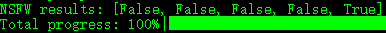
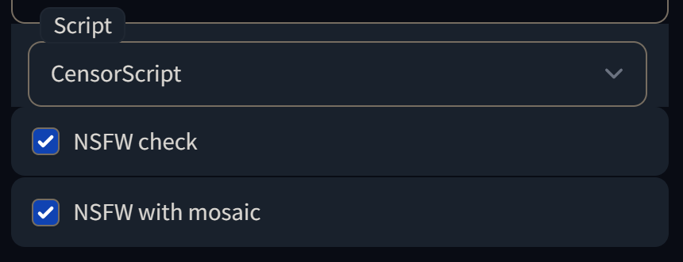

# sdapi-scripts
scripts for sdapi in [Stable Diffusion web UI](https://github.com/AUTOMATIC1111/stable-diffusion-webui)

---
## CensorScript.py

modified from extension: [stable-diffusion-webui-nsfw-censor](https://github.com/AUTOMATIC1111/stable-diffusion-webui-nsfw-censor)

I make it running as a selectable script, so you can control NSFW content through sdapi.

***NSFW check***: run safety_checker, it may take seconds for checking and print results in console:



***NSFW with mosaic***: add mosaic to NSFW content:


## SDAPI Request
add two paramters below:
```
txt2imgreq.script_name = "CensorScript"
txt2imgreq.script_args = [true,true]
```

## WebUI interface
